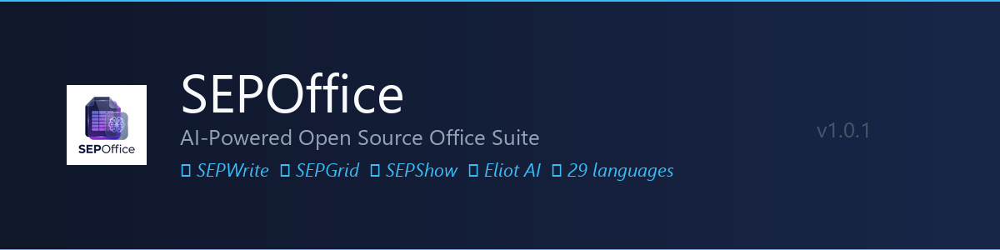
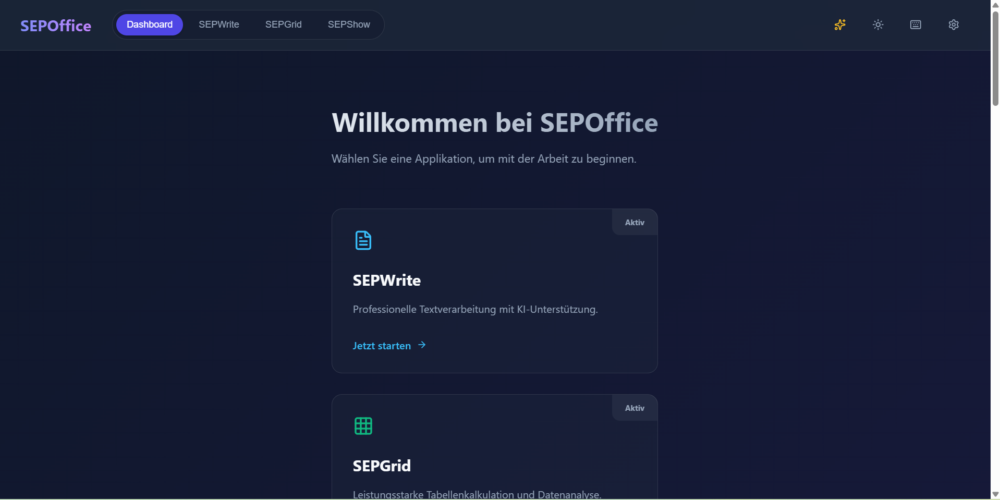
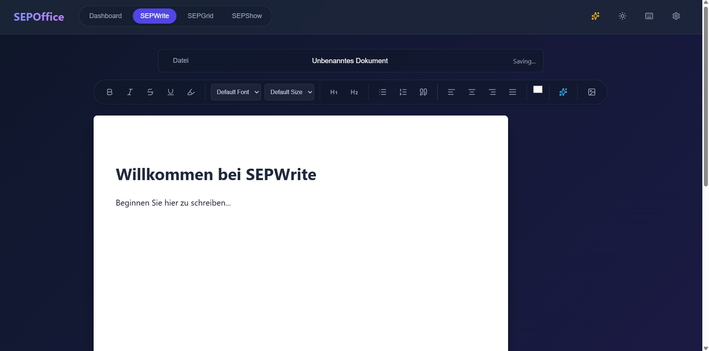
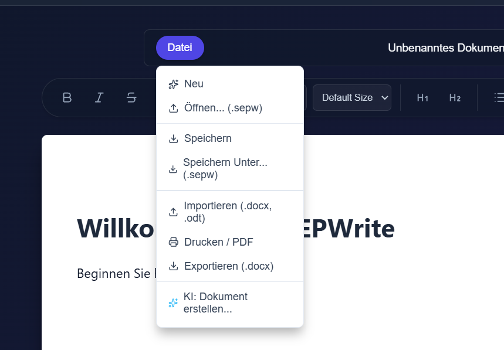
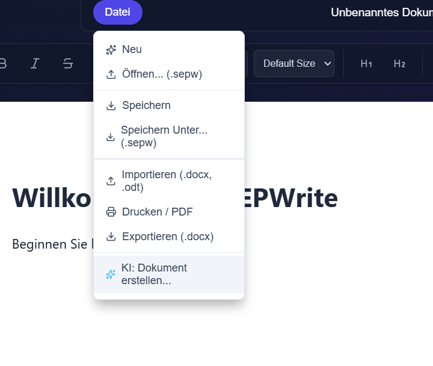
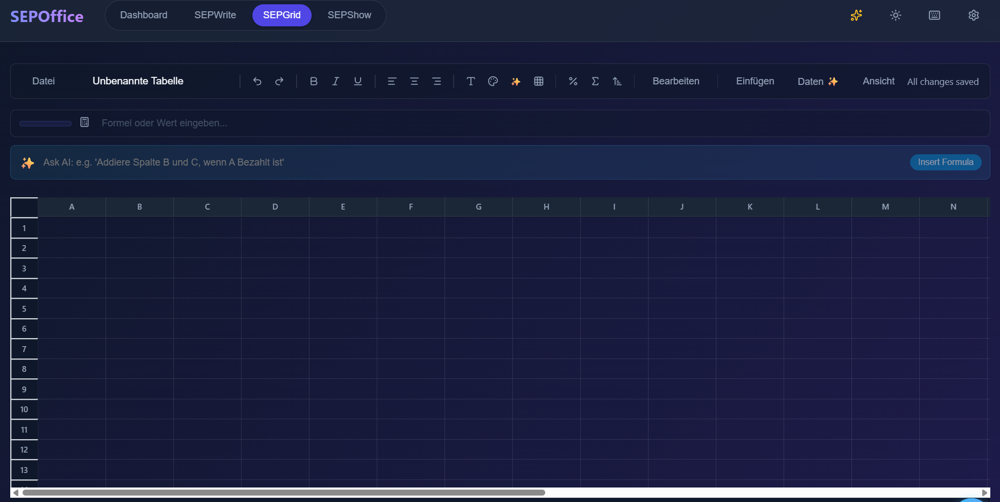
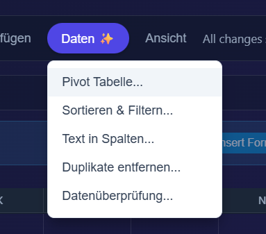
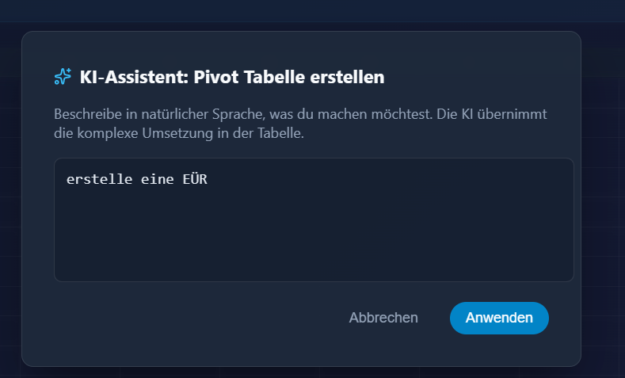
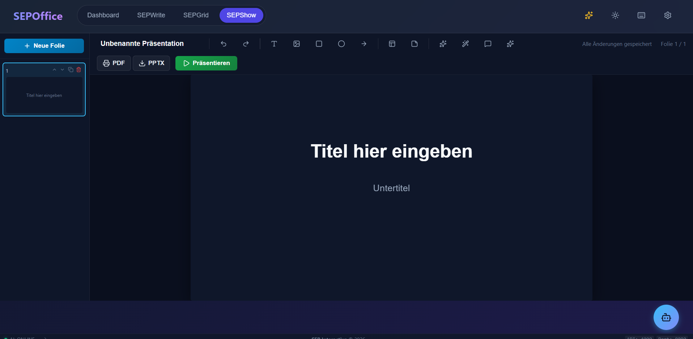
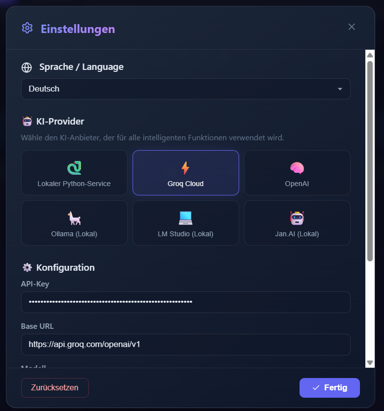

<p align="center">
  
</p>

<p align="center">
  <a href="https://github.com/GrafBier/SEPOffice/releases/latest"></a>
  
  
  
  
</p>

<p align="center">
  <b>SEPOffice</b> is a modern, AI-powered desktop office suite — free and open source.<br/>
  Write documents, crunch numbers, build presentations — all with a built-in AI assistant.
</p>

---

## ⬇️ Download

**[→ Download SEPOffice Setup (Windows)](https://github.com/GrafBier/SEPOffice/releases/latest)**

No installation required for the portable version. Just run `SEPOffice Setup 1.0.1.exe`.

---

## 📸 Screenshots

### Dashboard


### 📝 SEPWrite — Textverarbeitung


<details>
<summary>Datei-Menü & KI-Dokument erstellen</summary>




</details>

### 📊 SEPGrid — Tabellenkalkulation


<details>
<summary>Daten-Menü & KI-Assistent</summary>




</details>

### 🎭 SEPShow — Präsentationen


### ⚙️ Einstellungen & KI-Provider


---

## ✨ Features

### 📝 SEPWrite
- Rich-Text-Editor (TipTap) mit Fett, Kursiv, Überschriften, Listen, Zitate
- Schriftart & Schriftgröße frei wählbar
- **Datei-Format:** Eigenes `.sepw`-Format, Import/Export `.docx` & `.odt`
- Drucken / PDF-Export
- **KI: Dokument erstellen** — beschreibe das Dokument, KI erstellt es vollständig formatiert

### 📊 SEPGrid
- Tabellenkalkulation mit **10.000 Zeilen × 26 Spalten** pro Sheet
- Formelunterstützung: `SUM`, `AVERAGE`, `IF`, `VLOOKUP` u.v.m.
- **KI-Formelgenerator:** Natürlichsprachliche Beschreibung → fertige Formel
- **Daten ✨-Menü:** Pivot-Tabelle, Sortieren & Filtern, Text in Spalten, Duplikate entfernen, Datenüberprüfung — alles KI-gestützt
- Import/Export `.xlsx` & `.ods`
- Live-Balkendiagramme, mehrere Tabellenblätter

### 🎭 SEPShow
- Canvas-basierter Folien-Editor (Konva)
- Elemente: Text, Bild, Rechteck, Kreis, Pfeil, Tabelle, KI-Layout
- Export als **PDF** und **PPTX**
- Vollbild-Präsentationsmodus
- Speaker Notes pro Folie

### 🤖 KI-Provider (frei wählbar)
| Provider | Typ |
|----------|-----|
| Lokaler Python-Service (Qwen2.5) | 🔒 Lokal, kein Internet |
| Ollama | 🔒 Lokal |
| LM Studio | 🔒 Lokal |
| Jan.AI | 🔒 Lokal |
| Groq Cloud | ☁️ Cloud (schnell, kostenlos) |
| OpenAI | ☁️ Cloud |

### 🌍 29 Sprachen
Deutsch, English, 中文, Français, Español, Italiano, Русский, 日本語, 한국어, Português, العربية, Türkçe, Tiếng Việt, ไทย, Bahasa Indonesia, Ελληνικά, Nederlands, हिन्दी, বাঙালি, Bahasa Melayu, فارسی, עברית, Polski, Čeština, Svenska, Norsk, Dansk, Suomi, Українська

---

## 🛠️ Tech Stack

| Schicht | Technologie |
|---------|-------------|
| Frontend | React 19, Vite, TipTap, Konva, Lucide, Recharts |
| Desktop | Electron 40 |
| Backend | Node.js, Express, SQLite |
| AI Service | Python, FastAPI, Transformers (Qwen2.5-0.5B) |
| Build | PyInstaller, electron-builder, NSIS |

---

## 🚀 Für Entwickler

```bash
# Dependencies installieren
npm install

# Python-Umgebung
python -m venv .venv
.venv\Scripts\pip install -r services/ai/requirements.txt

# Entwicklungsmodus starten
npm run dev:all          # Web + API + AI

# Vollständigen Build erstellen
npm run desktop:build    # AI-Binary + Frontend + Installer
```

---

## 📖 Benutzerhandbücher

| | | |
|---|---|---|
| [English](docs/manual/manual_en.md) | [Deutsch](docs/manual/manual_de.md) | [Français](docs/manual/manual_fr.md) |
| [Español](docs/manual/manual_es.md) | [中文](docs/manual/manual_zh.md) | [Italiano](docs/manual/manual_it.md) |
| [Русский](docs/manual/manual_ru.md) | [日本語](docs/manual/manual_ja.md) | [한국어](docs/manual/manual_ko.md) |
| [Português](docs/manual/manual_pt.md) | [العربية](docs/manual/manual_ar.md) | [Türkçe](docs/manual/manual_tr.md) |
| [Tiếng Việt](docs/manual/manual_vi.md) | [ไทย](docs/manual/manual_th.md) | [Bahasa Indonesia](docs/manual/manual_id.md) |
| [Ελληνικά](docs/manual/manual_el.md) | [Nederlands](docs/manual/manual_nl.md) | [हिन्दी](docs/manual/manual_hi.md) |
| [বাঙালি](docs/manual/manual_bn.md) | [Bahasa Melayu](docs/manual/manual_ms.md) | [فارسی](docs/manual/manual_fa.md) |
| [עברית](docs/manual/manual_he.md) | [Polski](docs/manual/manual_pl.md) | [Čeština](docs/manual/manual_cs.md) |
| [Svenska](docs/manual/manual_sv.md) | [Norsk](docs/manual/manual_no.md) | [Dansk](docs/manual/manual_da.md) |
| [Suomi](docs/manual/manual_fi.md) | [Українська](docs/manual/manual_uk.md) | |

---

<p align="center">© 2026 <b>Simon Erich Plath</b> · SEP Interactive · MIT License</p>
